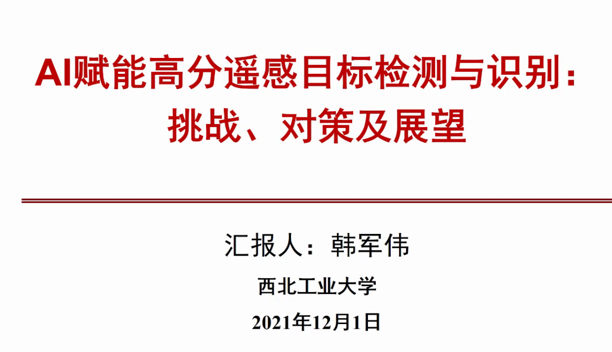
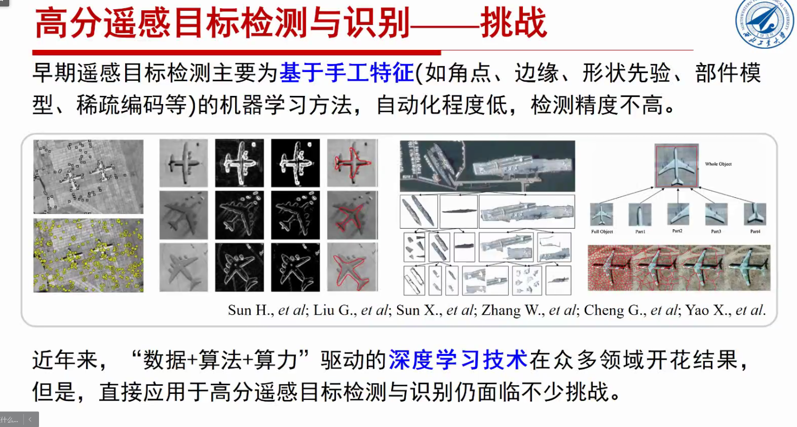
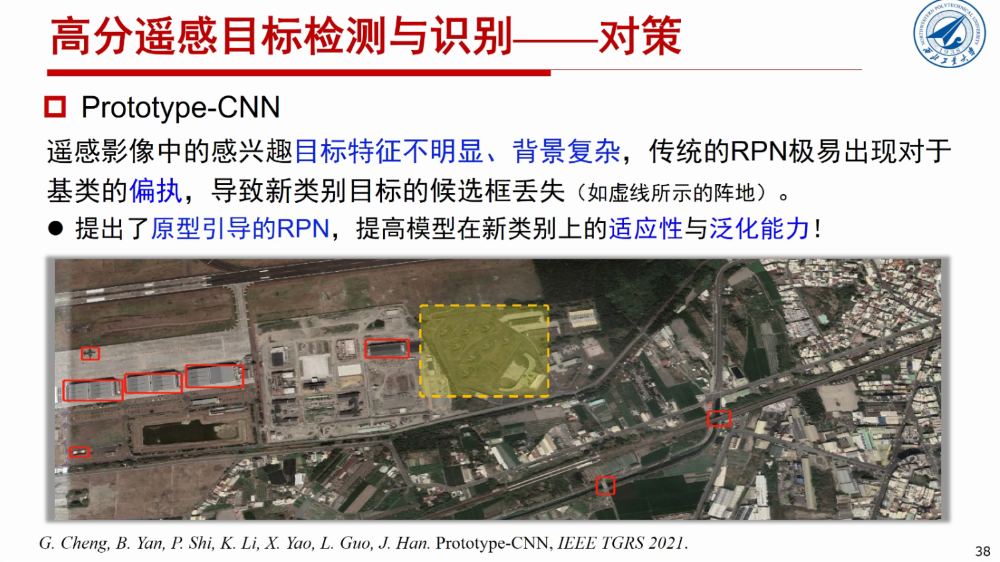

- 

- 

- 

智能解译 重要目标的识别

- 
  - 空间分辨率提高后，解析更方便

- 
  - 十年工作的挑战

- 

- ## 挑战一 旋转不变性

- ## 挑战二 不是简单的aabb包围框

- ## 挑战三  无监督学习 不能精细标注

- 

- ## 挑战四 小样本

- 

- ## 挑战五 视角单一

- 

# 解决方案

## 挑战1 旋转

## 挑战2 旋转候选框

## 挑战3 弱监督

## 挑战4 小样本

## 挑战4 视角太少

# 十年的感悟 和 展望

## 小目标检测识别

**不同来源的数据结合起来，迁移学习** 在大数据量里炼丹用到小数据量

