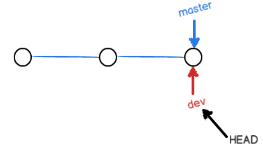

### 一、初始化、将自己本地仓库同步github

- ```stylus
  git config --global http.proxy "http://127.0.0.1:7890"
  git config --global https.proxy "https://127.0.0.1:7890"
  ```

- 首先初始化本地仓库，cd到相应目录，`git init `
- `git add .` 简单地把所有文件加入仓库的**准备（暂存区）**状态，`git commit -m "lang"`将文件设置为就绪状态。
- `git remote add origin git@***.git`
- 最后，同步`git push -u master`,同步到默认分支。由于远程库是空的，我们第一次推送`master`分支时，加上了`-u`参数，Git不但会把本地的`master`分支内容推送的远程新的`master`分支，还会把本地的`master`分支和远程的`master`分支关联起来，在以后的推送或者拉取时就可以简化命令（好像github默认分支名字是main，需要改一下默认）
- 如果添加的时候地址写错了，或者就是想删除远程库，可以用`git remote rm <name>`命令。使用前，建议先用`git remote -v`查看远程库信息：

### 二、在本地添加修改回退

#### git只能管理文本，二进制文件慎重

- `git status`查看文件状态，是否需要add/commit。`git add`管理的是修改，确保所有修改都完成之后，在进行添加提交。

- 增量同步`git push origin master`，所以远程仓库名最好就设置为origin不变。

- 本地的版本管理：

  git是树状结构，head指针指向每次**commit记录**构成的树上。使用`git log`查看当前树

  进行回退到上次提交：`git reset --hard HEAD`.

  取消回退：`git reset --hard (\W*?)` 需要填版本号的前几位，版本号遗忘时使用`git relog`查看。

  - 对单个文件

  用**版本库**替换工作区版本：`git checkout -- filename`

  取消添加到暂存区：`git reset HEAD filename`

- 将暂存区和工作区的file一并删除`git rm filename`

### 三、本地->远程

- 查看远程仓库信息`git remote -v`
- push就用`git push origin master`

### 四，远程到本地

- 先git fetch origin master 把仓库里的东西取回来，用户**自己判断**是否要合并到本机上

  ```
  //查询当前远程的版本
  $ git remote -v
  //获取最新代码到本地(本地当前分支为[branch]，获取的远端的分支为[origin/branch])
  $ git fetch origin master  [示例1：获取远端的origin/master分支]
  $ git fetch origin dev [示例2：获取远端的origin/dev分支]
  //查看版本差异
  $ git log -p master..origin/master [示例1：查看本地master与远端origin/master的版本差异]
  $ git log -p dev..origin/dev   [示例2：查看本地dev与远端origin/dev的版本差异]
  //合并最新代码到本地分支
  $ git merge origin/master  [示例1：合并远端分支origin/master到当前分支]
  $ git merge origin/dev [示例2：合并远端分支origin/dev到当前分支]
  merge时候遇到不是同一个库 --allow-unrelated-historie 
  ```

  

- git pull 直接**拉取并且合并**，可能需要手动解决冲突问题

### 四、多人协同

- 多分支管理

  `git branch`展示所有branch

  `git branch dev`,`git switch dev`.创建并切换分支。

  

  `git merge dev`将dev与当前分支合并。

  `git branch -d dev`删除dev分支

