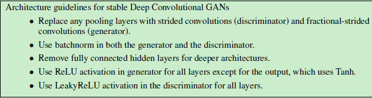
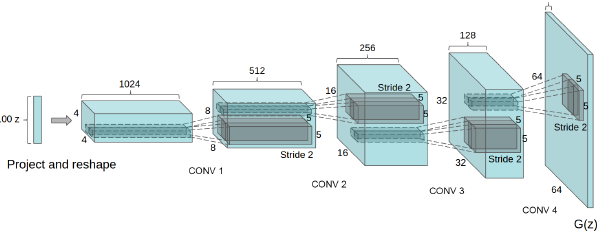
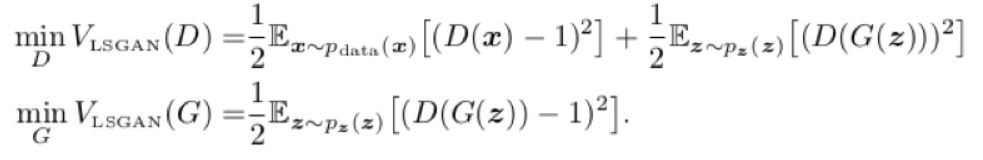
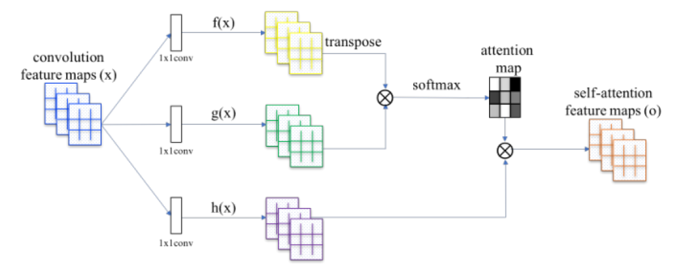
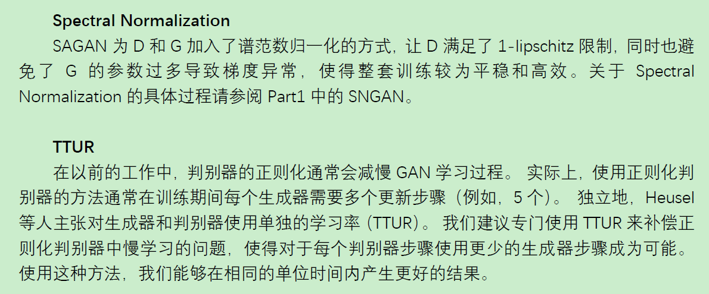

## GAN

### DCGAN

**improved dcgan**

- 一定程度上解决了生成结果多样性不足的问题，生成结果坍缩到一个样本上**minibatch discrimination**
- 更新参数是滚动平均，这个在stylegan也有
- 

### LSGAN

解决了梯度消失的问题，在用JS DIVERGENCE时，如果输入输出没有交集，那么训练就无法进行，这时候一般加噪声使得有交集。当 P1 和 P2 不重叠或重叠部分可忽略的可能性非常大时，当判别器达到最优时，生成器仍然是不迭代的。

### SNGAN

使用谱函数进行一番神奇操作，为了使得对噪声不敏感

### SAGAN

利用了attention机制，解决感受野受限的问题（想要一个大的感受野，CNN只能提高深度）

self attention

