UE空山新雨后

## 第一周

1. 从quiixel bridge下载想要的model
2. 项目设置
   - 渲染--光照--生成网格体距离场
   - SSGI屏幕空间全局光照
   - 曝光。。
   - 插件 内置hdri

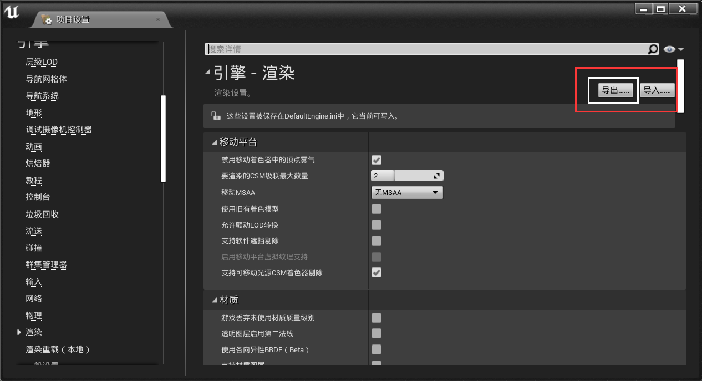

可以方便的导入导出配置选项

### 项目初始设置

1. 为什么光照变暗了？

   光照选项里的游戏设置一栏，默认打开就是游戏时的样子，如果关闭，则可以手动调整曝光值。

   在游戏中，有后处理体积，变暗就是后处理体积里的曝光选项默认值的问题，修改为0即可。

2. 设置成最高质量渲染 过场动画

   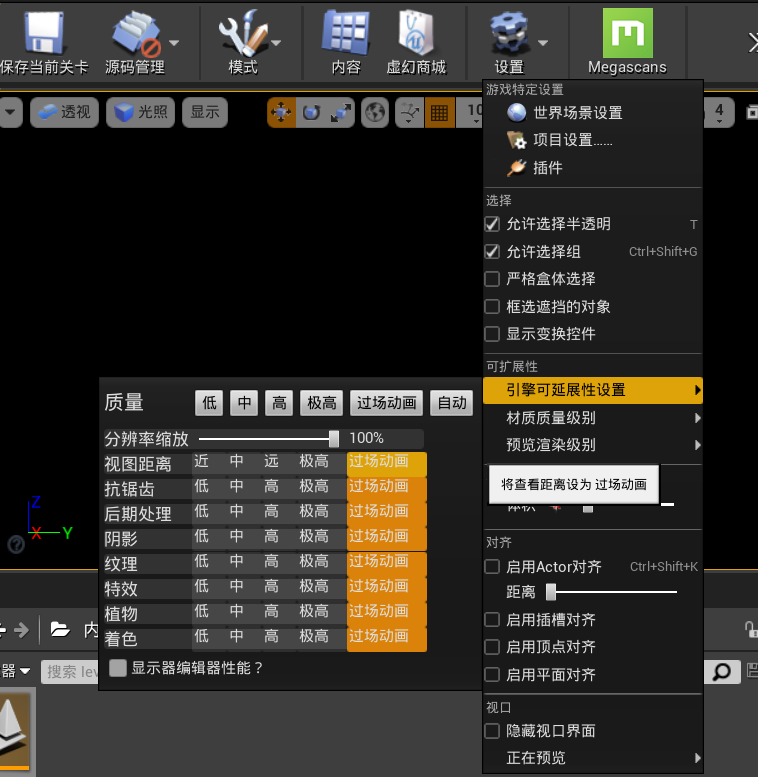

3. 使用ctrl + 1,2，等创建几个视点，按1,2跳转到相应的视点。

4. ALT +中键 讲坐标轴移动到所在位置处

5. ALT + SHIFT + 旋转位移 = = 复制到相应位置

6. 在视口里选择过场动画

   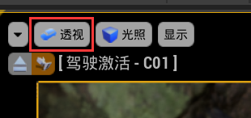

7. 创建摄像机，并在视口里选择这个摄像机

   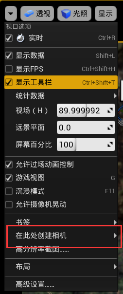

8. 摄像机的聚焦属性设置，胶卷也能设置

   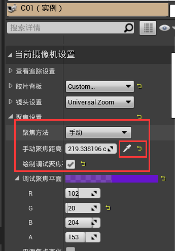

9. **植物的随着距离远离，他的几何会变的非常简单，这叫做billboard（广告牌）**

   如何去掉这个特效？ LOD组里设置这个

   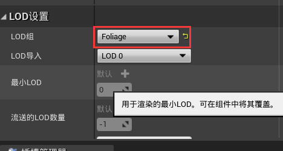

   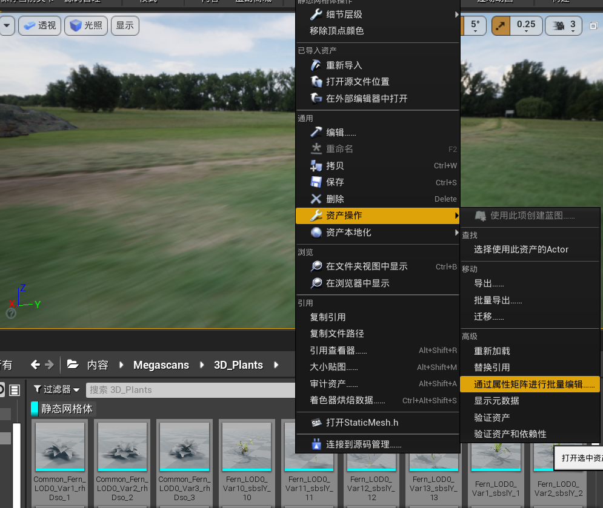

   批量操作

10. 天光有个距离场环境光遮蔽，这个效果有点多余了，主要是用屏幕空间全局光照实现软阴影

    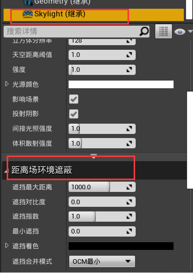

11. 多多少少没啥技术难度

#### 06 调材质

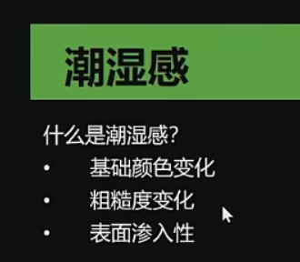

1. 调整粗糙度

   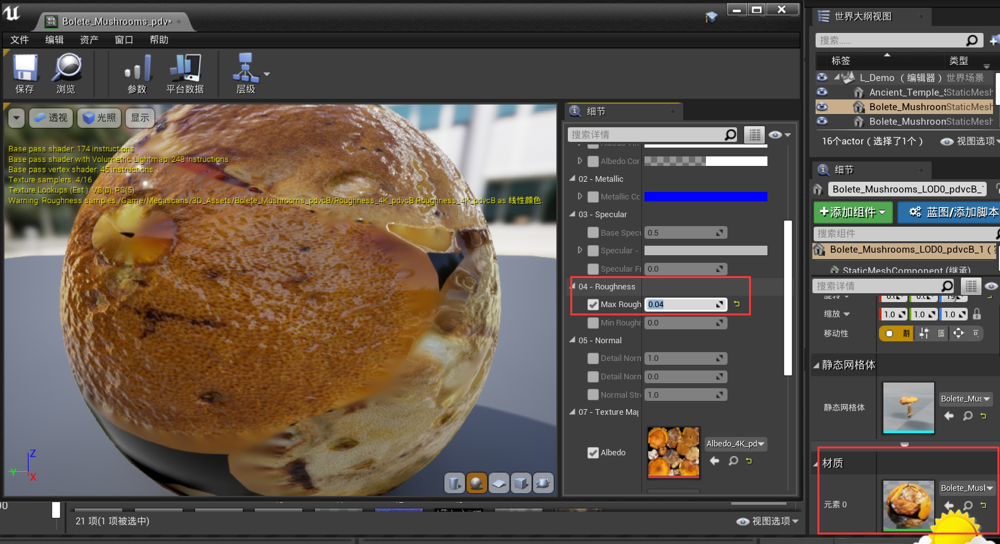

2.  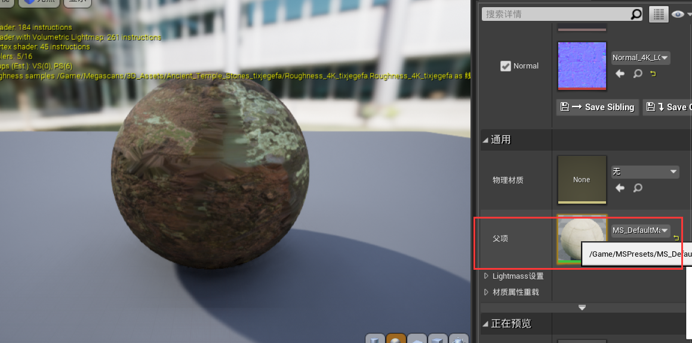

   找到母材质的一个函数的输入部分，对其进行修改后面会继承

   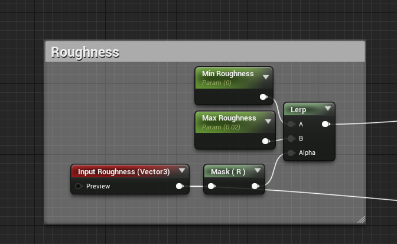

3. 使用hdri环境光贴图

   下载hdri图片https://polyhaven.com/a/autumn_ground，然后导入ue后 设置mipmap为无，以及纹理压缩尺寸。

#### 边缘混合 PDO（像素深度偏移）

#### 在主材质的编辑界面找到这部分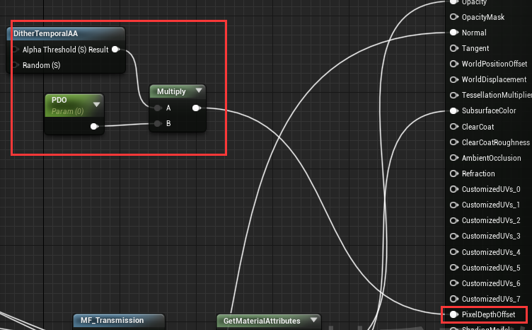

是一种资产边缘混合，减少硬边缘的有效手段，砖缝处的泥土用的是视差贴图

#### 设置assert的lod层级

r.forcelod = 0 强制使用最高层级的lod 但还是不够

highpoly从quixel导入的时候 只选择高精度的mesh，重新导入

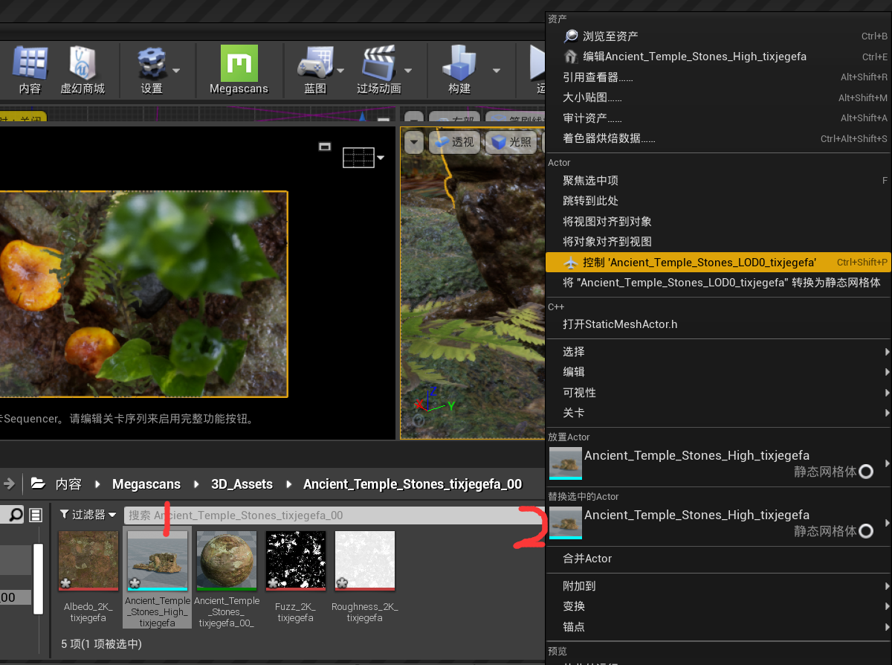

 这样来替换相应的actor里面的静态网格体

#### seq输出结果

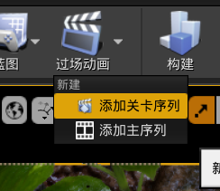

添加sequencer

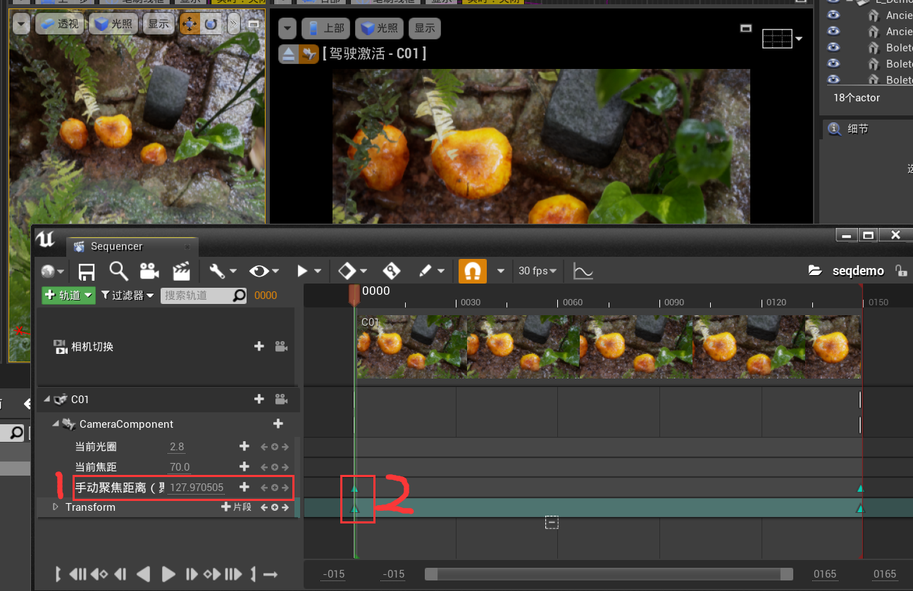

首先移动摄像机位置，按S保存关键帧

对每个关键帧设置焦距，在摄像机的那里保存

将2的插值方法设置成线性插值 最后输出

## 第二周

### TAA时序抗锯齿

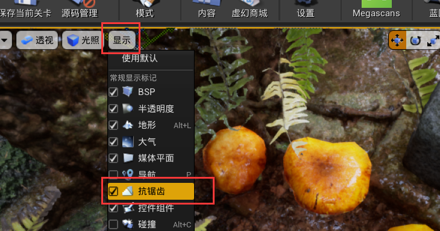

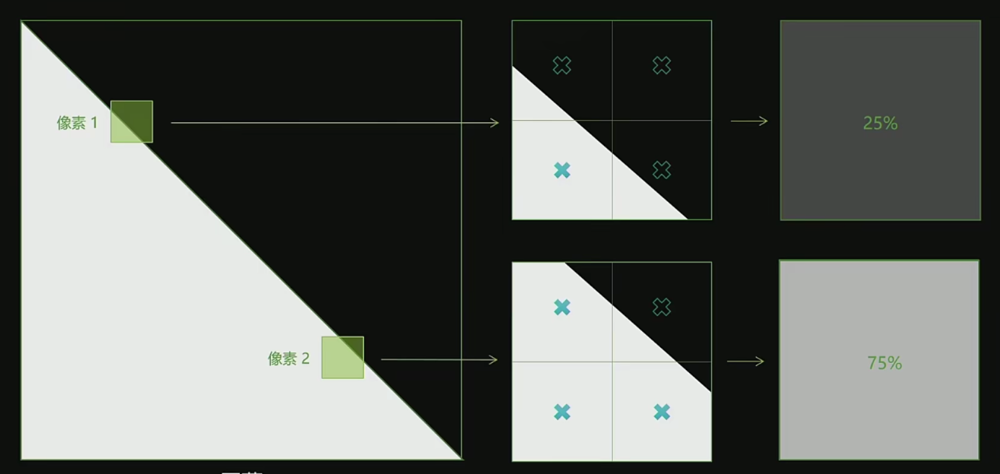

SSAA超级采样 像素拆成子像素

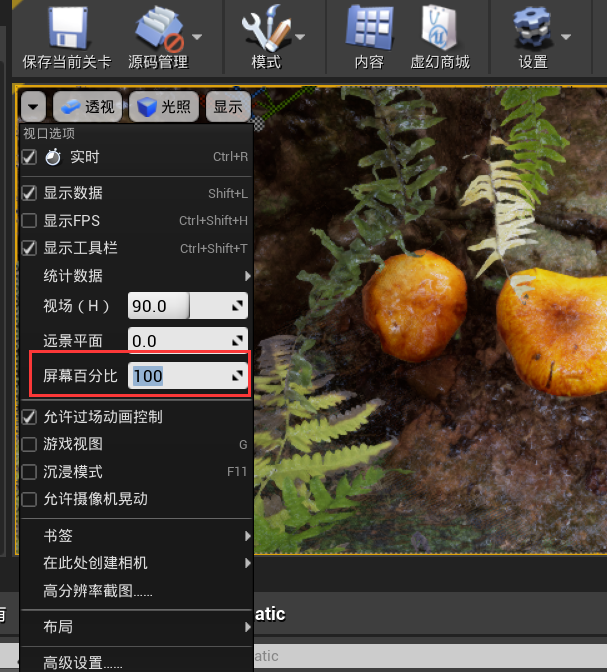

虚幻是可以手动设置超级采样，就和战地5一样

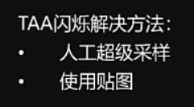

### MipMap

避免闪烁，一旦太远，一根光线穿过覆盖纹理中的一大片面积，此时会因为精度产生闪烁
